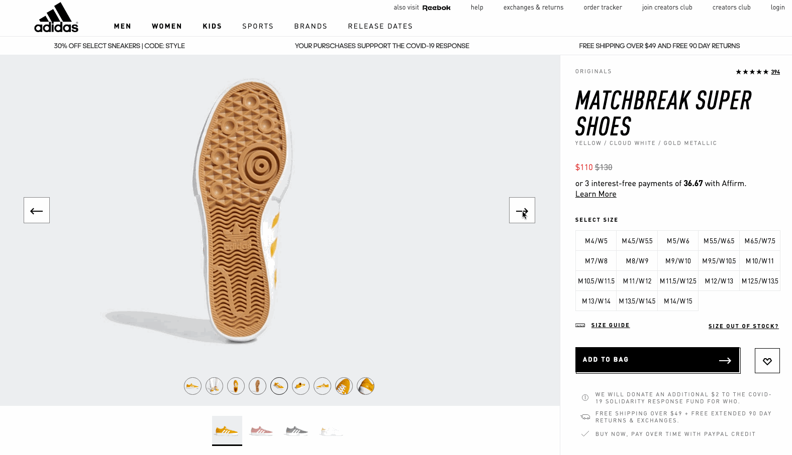
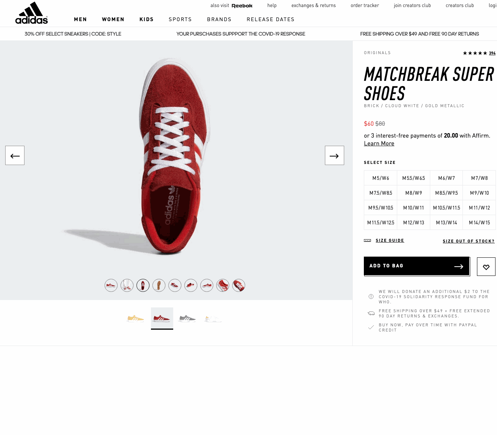
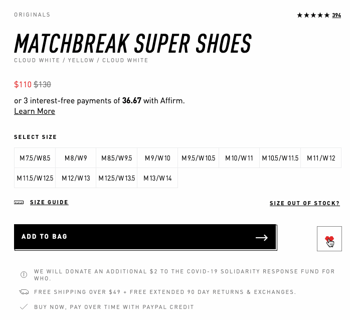
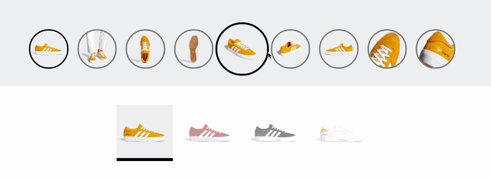

# Adidas Product View Component
This repo contains react components that mimic the product view component on www.adidas.com

## Looping Slideshow Carousel


## Accessible and Scalable


## Interactive User Experience


## Modern UI


## Getting Started


```sh
npm install
npm run react-dev
npm start
```


```sh
docker-compose up
```

# Server API

## Shoe

<details> 
  <summary>Click To Expand</summary>

### Get 

<details> 
  <summary>Click To Expand</summary>

  * GET `/api/products/:id`

**Path Parameters :**
  * `id` : product id

**Success Status Code :** `200`

**Returns :** JSON

```json
    {
      "id": "Number",
      "name": "String",
      "collection_name": "String",
      "review_count": "String",
      "review_avg": "String",
      "color": [
        {
          "id": "Number",
          "url": "String",
          "name": "String",
          "list_price": "Number",
          "sale_price": "Number",
          "images": [
            {
              "id": "Number",
              "url": "String"
            }
          ],
          "sizes": [
            {
              "id": "Number",
              "size": "String",
              "quantity": "Number"
            },
            ...
          ]
        },
        ...
      ],

    }
```

</details>

### Add 

<details> 
  <summary>Click To Expand</summary>

  * POST `/api/products`

**Success Status Code :** `201`

**Request Body :** JSON (new shoe)

```json
    {
      "id": "Number",
      "name": "String",
      "collection_name": "String",
      "review_count": "String",
      "review_avg": "String",
      "color": [
        {
          "id": "Number",
          "url": "String",
          "name": "String",
          "list_price": "Number",
          "sale_price": "Number",
          "images": [
            {
              "id": "Number",
              "url": "String"
            }
          ],
          "sizes": [
            {
              "id": "Number",
              "size": "String",
              "quantity": "Number"
            },
            ...
          ]
        },
        ...
      ]
    }
```

</details>

### Update 

<details> 
  <summary>Click To Expand</summary>

  * PATCH `/api/product/:id`

**Path Parameters :**
  * `id` : product id

**Success Status Code :** `202`

**Request Body :** JSON (updated)

```json
    {
      "id": "Number",
      "name": "String",
      "collection_name": "String",
      "review_count": "String",
      "review_avg": "String"
    }
```

</details>

### Delete 

<details> 
  <summary>Click To Expand</summary>

  * DELETE `/api/products/:id`

**Path Parameters :**
  * `id` : product id

**Success Status Code :** `204`

</details>

</details>

## Shoe Color

<details> 
  <summary>Click To Expand</summary>

### Get

<details> 
  <summary>Click To Expand</summary>

  * GET `/api/products/:id/color/:id`

**Path Parameters :**
  * `id` : product id, color id

**Success Status Code :** `200`

**Returns :** JSON (specific shoe)

```json
    {
        "id": "Number",
        "url": "String",
        "name": "String",
        "list_price": "Number",
        "sale_price": "Number",
          "images": [
            {
              "id": "Number",
              "url": "String"
            }
          ],
        "sizes": [
        {
          "id": "Number",
          "size": "String",
          "quantity": "Number"
        }
        ]
    }
```

</details>

### Add 

<details> 
  <summary>Click To Expand</summary>

  * POST `/api/products/:id/color`

  **Path Parameters:**
  * `id` : product id, color

**Success Status Code :** `201`

**Request Body :** JSON (new color)

```json
    {
        "id": "Number",
        "url": "String",
        "name": "String",
        "list_price": "Number",
        "sale_price": "Number",
        "images": [
          {
            "id": "Number",
            "url": "String"
          }
        ],
        "sizes": [
          {
            "id": "Number",
            "size": "String",
            "quantity": "Number"
          }
        ]
    }
```

</details>

### Update

<details> 
  <summary>Click To Expand</summary>

  * PATCH `/api/products/:id/color/:id`

**Path Parameters :**
  * `id` : product id, color id

**Success Status Code :** `202`

**Request Body :** JSON (updated color)

```json
    {
        "id": "Number",
        "url": "String",
        "name": "String",
        "list_price": "Number",
        "sale_price": "Number"
    }
```

</details>

### Delete 

<details> 
  <summary>Click To Expand</summary>

* DELETE `/api/products/:id/color/:id`

**Path Parameters :**
  * `id` : product id, color id

**Success Status Code :** `204`

</details>

</details>

## Shoe Color Images

<details> 
  <summary>Click To Expand</summary>

### Get (one image)

<details> 
  <summary>Click To Expand</summary>

  * GET `/api/products/:id/color/:id/image/:id`

**Path Parameters :**
  * `id` : product id, color id, image id

**Success Status Code :** `200`

**Returns :** JSON (specific shoe image)

```json
    {
      "images": [
        {
          "id": "Number",
          "url": "String"
        }
      ]
    }
```

</details>

### Add 

<details> 
  <summary>Click To Expand</summary>

  * POST `/api/products/:id/color/:id/image`

  **Path Parameters:**
  * `id` : product id, color id, image

**Success Status Code :** `201`

**Request Body :** JSON (new image)

```json
    {
      "images": [
        {
          "id": "Number",
          "url": "String"
        }
      ]
    }
```

</details>

### Update

<details> 
  <summary>Click To Expand</summary>

  * PATCH `/api/products/:id/color/:id/image/:id`

**Path Parameters :**
  * `id` : product id, color id, image id

**Success Status Code :** `202`

**Request Body :** JSON (update image)

```json
    {
      "images": [
        {
          "id": "Number",
          "url": "String"
        }
      ]
    }
```

</details>

### Delete 

<details> 
  <summary>Click To Expand</summary>

* DELETE `/api/products/:id/color/:id/image/:id`

**Path Parameters :**
  * `id` : product id, color id, image id

**Success Status Code :** `204`

</details>

</details>

## Shoe Color Size

<details> 
  <summary>Click To Expand</summary>

### Get

<details> 
  <summary>Click To Expand</summary>

  * GET `/api/products/:id/color/:id/size/:id`

**Path Parameters :**
  * `id` : product id, color id, size id

**Success Status Code :** `200`

**Returns :** JSON (specific shoe size)

```json
    {
      "id": "Number",
      "size": "String",
      "quantity": "Number"
    }
```

</details>

### Add 

<details> 
  <summary>Click To Expand</summary>

  * POST `/api/products/:id/color/:id`

**Path Parameters :**
  * `id` : product id, color id

**Success Status Code :** `201`

**Request Body :** JSON (new shoe size)

```json
    {
      "id": "Number",
      "size": "String",
      "quantity": "Number"
    }
```
</details>
  
### Update
  
<details> 
  <summary>Click To Expand</summary>

  * PUT `/api/products/:id/color/:id`

**Path Parameters :**
  * `id` : product id, color id

**Success Status Code :** `202`

**Request Body**: JSON (updated quantity)

```json
    {
      "id": "Number",
      "size": "String",
      "quantity": "Number"
    }
```
</details>

### Delete

<details> 
  <summary>Click To Expand</summary>

* DELETE `/api/products/:id/color/:id/size/:id`

**Path Parameters :**
  * `id` : product id, color id, size id

**Success Status Code :** `204`

</details>

</details>